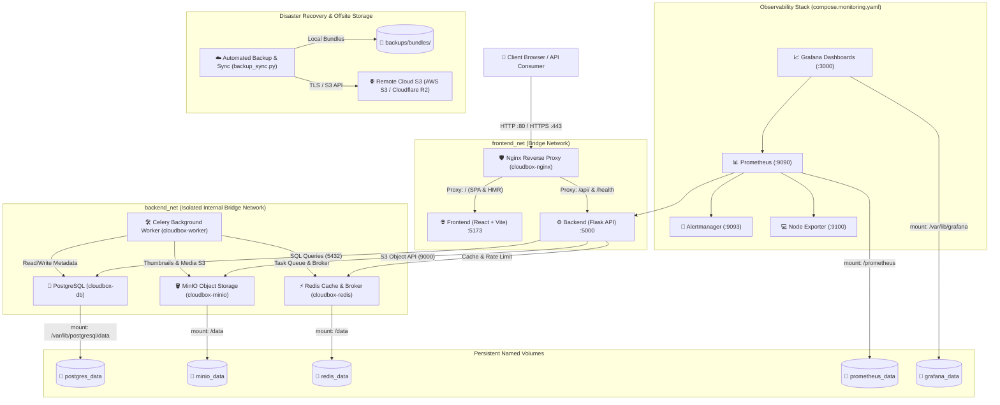

# CloudBox — Enterprise Mini Cloud Storage Platform (Phase 7)

CloudBox is a self-hosted mini cloud storage platform containerized with Docker and Docker Compose.

Phase 7 delivers **Automated Cloud VM Deployment**, **Domain & Let's Encrypt TLS Automation**, **Prometheus & Grafana Observability**, **Automated Multi-Cloud Off-Site Backup Replication**, **Automated Disaster Recovery Verification**, **Automated Deployment & Rollback Workflows**, and a **100% Passing Automated Test Suite (68 / 68 Tests)**.

---

## 1. System Architecture

CloudBox implements an isolated dual-bridge microservices architecture with least-privilege networking, non-root service execution, multi-tier Grafana dashboards, and cryptographic disaster recovery.



---

## 2. Infrastructure & Service Inventory (11 Containers)

| Service | Container Name | Networks | Ports | Health Check Command |
| :--- | :--- | :--- | :--- | :--- |
| **Nginx** | `cloudbox-nginx` | `frontend_net` | `80:80`, `443:443` | `curl -f http://localhost/nginx_health` |
| **Frontend** | `cloudbox-frontend` | `frontend_net` | `5173:5173` | `wget --spider -q http://127.0.0.1:5173` |
| **Backend** | `cloudbox-backend` | `frontend_net`, `backend_net` | `5000:5000` | `curl -f http://localhost:5000/health` |
| **Worker** | `cloudbox-worker` | `backend_net` | *None* | Background worker queue process |
| **Redis** | `cloudbox-redis` | `backend_net` | `6379` *(internal)* | `redis-cli ping` |
| **PostgreSQL** | `cloudbox-db` | `backend_net` | `5432` *(internal)* | `pg_isready -U cloudbox_user` |
| **MinIO** | `cloudbox-minio` | `backend_net` | `9000`, `9001` | `tcp socket probe :9000` |
| **Prometheus** | `cloudbox-prometheus` | `frontend_net`, `backend_net` | `9090:9090` | Internal Prometheus health |
| **Grafana** | `cloudbox-grafana` | `frontend_net`, `backend_net` | `3000:3000` | `curl -f http://localhost:3000/api/health` |
| **Alertmanager** | `cloudbox-alertmanager`| `frontend_net`, `backend_net` | `9093:9093` | `curl -f http://localhost:9093/-/healthy` |
| **Node Exporter** | `cloudbox-node-exporter`| `frontend_net`, `backend_net` | `9100` *(internal)*| Metric scrape probe |

---

## 3. Quick Start & Deployment Commands

### Local Development Mode
```bash
# Start core application stack
docker compose up -d

# Check service health
powershell -File scripts/health_check.ps1   # Windows
# or
bash scripts/health_check.sh               # Linux / macOS
```

### Production Mode with Resource Limits & Monitoring
```bash
# Start application with production limits and Prometheus/Grafana monitoring
docker compose -f compose.yaml -f compose.prod.yaml -f compose.monitoring.yaml up -d
```

* **Application URL**: `http://localhost` (Nginx) / `http://localhost:5173` (Vite)
* **API Documentation & Root**: `http://localhost:5000/`
* **Prometheus Metrics**: `http://localhost:5000/api/metrics/prometheus`
* **Grafana Dashboards**: `http://localhost:3000` (`admin` / `${GRAFANA_ADMIN_PASSWORD}`)
* **Prometheus UI**: `http://localhost:9090`
* **Alertmanager UI**: `http://localhost:9093`

---

## 4. Disaster Recovery, Replication & Integrity Auditing

### Automated Backup & Off-Site Replication Pipeline
```bash
# Execute local unified backup + off-site S3 replication + isolated recovery verification
python scripts/backup_sync.py --verify-recovery
```

### Storage Consistency & Reconciliation Audit
```bash
# Scan PostgreSQL metadata vs MinIO bucket objects with deep SHA-256 validation
docker compose exec -e PYTHONPATH=. backend python scripts/storage_integrity_audit.py --deep

# Safely purge orphaned files and stale chunk staging objects
docker compose exec -e PYTHONPATH=. backend python scripts/storage_integrity_audit.py --repair --confirm-repair
```

### Isolated Disaster Recovery Verification
```bash
# Verify recovery end-to-end into isolated test DB without touching live data
python scripts/restore_manager.py --isolated
```

---

## 5. Automated Deployment & Rollback

```bash
# Automated deployment with pre-deploy safety backup and health checks
powershell -File scripts/deploy.ps1     # Windows
bash scripts/deploy.sh                 # Linux

# Safe rollback
powershell -File scripts/rollback.ps1   # Windows
bash scripts/rollback.sh               # Linux
```

---

## 6. Automated Test Suite (68 / 68 Passing)

```bash
docker compose exec -e PYTHONPATH=. backend pytest -v
```

* `test_phase7_monitoring_and_replication.py`: Prometheus exposition format, remote backup service, local-only fallback.
* `test_security_audit.py`: Security audit logging, sensitive parameter redaction, production secret validation, user isolation.
* `test_integrity_audit.py`: Storage reconciliation logic, missing/orphan object detection, chunk staging audits.
* `test_disaster_recovery_e2e.py`: Backup manifest generation, cryptographic SHA-256 verification, tamper rejection.
* `test_caching.py`: Redis cache hit/miss, invalidation, user isolation, resilient fallback.
* `test_chunked_uploads.py`: Initiation, multipart chunk upload, SHA-256 assembly, abort cleanup.
* `test_worker_tasks.py`: Celery async processing, thumbnail generation, metadata extraction, metrics.
* `test_analytics.py`: Storage distribution, category aggregation, timeline.
* `test_hardening.py`: Security headers, request ID tracing, API version status.
* `test_backup.py`: DB metadata export, retention pruning logic.
* `test_auth.py`, `test_files.py`, `test_versions.py`, `test_shares.py`, `test_trash.py`, `test_security.py`: Full Phase 1–5 regression test suite.

---

---

## 7. Phase 8 Production Readiness & Master Reports Index

* **[Phase 8 Master Implementation Report](file:///c:/Users/karth/Downloads/cloudbox/docs/phase8/PHASE8_FINAL_REPORT.md)**
* **[Evaluator Final Practical Demonstration Guide (Demos 1–7)](file:///c:/Users/karth/Downloads/cloudbox/docs/phase8/FINAL_DEMO_GUIDE.md)**
* **[Phase 8 Comprehensive Repository Audit](file:///c:/Users/karth/Downloads/cloudbox/docs/phase8/PHASE8_AUDIT.md)**
* **[End-to-End Functional Test Report (26/26 Tests Passed)](file:///c:/Users/karth/Downloads/cloudbox/docs/phase8/E2E_TEST_REPORT.md)**
* **[Performance Benchmark & Load Testing Report](file:///c:/Users/karth/Downloads/cloudbox/docs/phase8/PERFORMANCE_REPORT.md)**
* **[Resilience & Failure-Injection Test Report (7/7 Scenarios Passed)](file:///c:/Users/karth/Downloads/cloudbox/docs/phase8/RESILIENCE_REPORT.md)**
* **[Disaster Recovery & Backup Integrity Report](file:///c:/Users/karth/Downloads/cloudbox/docs/phase8/BACKUP_RESTORE_REPORT.md)**
* **[Security & OWASP Production Review](file:///c:/Users/karth/Downloads/cloudbox/docs/phase8/SECURITY_REVIEW.md)**
* **[Monitoring, Grafana & Alertmanager Validation Report](file:///c:/Users/karth/Downloads/cloudbox/docs/phase8/MONITORING_VALIDATION.md)**
* **[CI/CD & Deployment Automation Validation Report](file:///c:/Users/karth/Downloads/cloudbox/docs/phase8/DEPLOYMENT_VALIDATION.md)**

---

## 8. Phase 7 Documentation Index

* **[Phase 7 Implementation Report](file:///c:/Users/karth/Downloads/cloudbox/docs/phase7/PHASE7_IMPLEMENTATION_REPORT.md)**
* **[Cloud VM Deployment Guide](file:///c:/Users/karth/Downloads/cloudbox/docs/phase7/deployment.md)**
* **[Operations Runbooks (15 Incident Runbooks)](file:///c:/Users/karth/Downloads/cloudbox/docs/phase7/runbooks.md)**
* **[Demonstrations Guide (Demos A through H)](file:///c:/Users/karth/Downloads/cloudbox/docs/phase7/demo_guide.md)**
* **[Monitoring & Telemetry Architecture](file:///c:/Users/karth/Downloads/cloudbox/docs/phase7/monitoring.md)**
* **[Off-Site Backup & S3 Replication Guide](file:///c:/Users/karth/Downloads/cloudbox/docs/phase7/offsite_backups.md)**
* **[Backup Recovery Verification Runbook](file:///c:/Users/karth/Downloads/cloudbox/docs/phase7/backup_recovery_verification.md)**

---

## 9. Safe Shutdown

```bash
docker compose down
```

> **Warning:** Never run `docker compose down -v` to prevent destroying persistent named volumes (`postgres_data`, `minio_data`, `redis_data`, `prometheus_data`, `grafana_data`).


