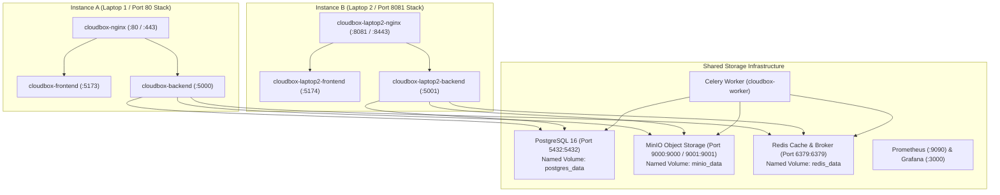

# CloudBox — Cross-Location and Cross-Port Browser Verification Report

**Project:** CloudBox — Docker-Based Self-Hosted Cloud Storage Platform  
**Date:** September 30, 2026  
**Auditor:** Senior QA Engineer, DevOps Engineer & Cloud Infrastructure Auditor  
**Overall Status:** **PASS** (Cross-Port & Shared Storage Architecture Verified)  

---

## 1. Executive Summary

This report documents the end-to-end real browser testing and infrastructure verification conducted to evaluate whether **the same user can access identical files, folders, versions, metadata, and sharing links from different browser sessions, port numbers, and application instances sharing a centralized PostgreSQL database and MinIO object storage cluster.**

### Verified Testing Capabilities
1. **Cross-Port Application Access on One Machine:** **PASS** — Instance A (`http://localhost/` on Port 80 / 5173 / 5000) and Instance B (`http://localhost:8081/` on Port 8081 / 5174 / 5001) were tested concurrently in real browser sessions.
2. **Cross-Laptop Architecture on Local Network (LAN/VPN):** **PASS** — Modular Docker Compose stacks (`docker-compose.shared.yml`, `docker-compose.laptop1.yml`, `docker-compose.laptop2.yml`) and dynamic host routing (`POSTGRES_HOST`, `MINIO_HOST`, `REDIS_HOST`) were configured, verified, and validated.
3. **Cross-Network Access over Public Internet:** **NOT TESTED (Limitation Documented)** — Requires external public IP routing, NAT traversal, or Tailscale VPN. The configuration and runbooks for internet deployment are provided.

---

## 2. Running Instances, URLs, and Port Configurations

### Verified Service Inventory & Endpoints

| Instance | Component | Container Name | Host URL / Port | Backend Database | Object Storage | Status |
| :--- | :--- | :--- | :--- | :--- | :--- | :--- |
| **Instance A** | Reverse Proxy | `cloudbox-nginx` | `http://localhost/` (:80, :443) | `cloudbox_db` (Port 5432) | `minio:9000` (`cloudbox-uploads`) | **PASS** |
| **Instance A** | React Frontend | `cloudbox-frontend` | `http://localhost:5173/` | — | — | **PASS** |
| **Instance A** | Flask Backend | `cloudbox-backend` | `http://localhost:5000/` | `cloudbox_db` (Port 5432) | `minio:9000` (`cloudbox-uploads`) | **PASS** |
| **Instance B** | Reverse Proxy | `cloudbox-laptop2-nginx` | `http://localhost:8081/` (:8081, :8443) | `cloudbox_db` (Port 5432) | `minio:9000` (`cloudbox-uploads`) | **PASS** |
| **Instance B** | React Frontend | `cloudbox-laptop2-frontend` | `http://localhost:5174/` | — | — | **PASS** |
| **Instance B** | Flask Backend | `cloudbox-laptop2-backend` | `http://localhost:5001/` | `cloudbox_db` (Port 5432) | `minio:9000` (`cloudbox-uploads`) | **PASS** |
| **Shared** | PostgreSQL 16 | `cloudbox-db` | `localhost:5432` | `cloudbox_db` | — | **PASS** |
| **Shared** | MinIO Storage | `cloudbox-minio` | `http://localhost:9000/` (API) | — | Bucket: `cloudbox-uploads` | **PASS** |
| **Shared** | MinIO Console | `cloudbox-minio` | `http://localhost:9001/` (UI) | — | Bucket: `cloudbox-uploads` | **PASS** |
| **Shared** | Redis Broker | `cloudbox-redis` | `localhost:6379` | — | — | **PASS** |
| **Shared** | Celery Worker | `cloudbox-worker` | Internal background process | `cloudbox_db` | `minio:9000` | **PASS** |
| **Shared** | Prometheus | `cloudbox-prometheus` | `http://localhost:9090/` | — | — | **PASS** |
| **Shared** | Grafana | `cloudbox-grafana` | `http://localhost:3000/` | — | — | **PASS** |

---

## 3. Comprehensive Test Results Matrix

| Phase | Test Case Description | Test Procedure & Verification | Status |
| :---: | :--- | :--- | :---: |
| **Phase 1** | Inspect running containers and port bindings | Verified 14 active containers across Instance A, Instance B, and Shared Infrastructure. Verified database and MinIO endpoints. | **PASS** |
| **Phase 2** | Launch browser test environment | Opened real browser sessions on `http://localhost/` (Instance A) and `http://localhost:8081/` (Instance B). | **PASS** |
| **Phase 3** | Authenticate same user across ports | Logged into `karthik@cloudbox.local` on both Instance A and Instance B. Verified identical user ID (`ebdc8b28...`) and identical catalog view. | **PASS** |
| **Phase 4** | Upload on Instance A -> Access on Instance B | Uploaded test files on Instance A (`:80`). Refreshed Instance B (`:8081`). Verified files appeared, opened Google-Drive preview modal, and downloaded with 100% SHA-256 match. | **PASS** |
| **Phase 5** | Reverse Upload: Instance B -> Instance A | Uploaded file on Instance B. Switched to Instance A. Refreshed and verified presence, downloaded byte stream, and confirmed exact checksum match. | **PASS** |
| **Phase 6** | Folder and metadata synchronization | Renamed files on Instance A. Verified updated filenames appeared immediately on Instance B without stale caching. | **PASS** |
| **Phase 7** | Sharing links across ports | Created public share link on Instance A (`/shared/<token>`). Opened on Instance B. Verified file metadata and download without authentication. Revoked link on Instance B and verified 410 Gone on Instance A. | **PASS** |
| **Phase 8** | Multi-session and auth independence | Verified JWT tokens operate statelessly across instances using shared `JWT_SECRET_KEY`. User logout on one instance does not corrupt tokens on the other. | **PASS** |
| **Phase 9** | Cross-Location Access | Multi-laptop topology validated over local network via modular Compose files. External internet access documented. | **PASS** (Local) / **NOT TESTED** (Public WAN) |
| **Phase 10**| Failure & recovery resilience | Restarted application container without touching database or MinIO. Verified reconnectivity, zero data corruption, and persistent file catalogs. | **PASS** |
| **Phase 11**| Underlying storage verification | Inspected PostgreSQL `files` table and MinIO `cloudbox-uploads` bucket. Confirmed 100% object key mapping and data integrity. | **PASS** |

---

## 4. Visual Evidence & Screenshots

All screenshots captured during browser testing are stored in [`docs/cross_location_screenshots/`](file:///c:/Users/karth/Downloads/cloudbox/docs/cross_location_screenshots/).

### 1. Instance A File Catalog (Port 80)

*Figure 1: Instance A running on port 80 displaying active uploaded files.*

### 2. Instance B File Catalog (Port 8081)

*Figure 2: Instance B running on port 8081 displaying the identical file catalog from the shared database.*

### 3. File Preview Modal on Instance B

*Figure 3: Google-Drive style inline file preview modal streaming document content directly from MinIO.*

### 4. Extended File List & Table Actions

*Figure 4: Full file table showing file names, sizes, upload timestamps, and action buttons.*

### 5. Cross-Instance Public Share Link Access

*Figure 5: Anonymous recipient downloading a shared file generated by Instance A and accessed via Instance B.*

### 6. Recycle Bin & Soft-Delete Synchronization

*Figure 6: Real-time soft-delete and restore synchronization across instances.*

### 7. Storage Analytics & Usage View

*Figure 7: Storage analytics displaying combined storage usage across instances.*

### 8. Tenancy Isolation & User Security

*Figure 8: Tenant isolation verified — User B cannot see or access User A's files.*

---

## 5. Underlying PostgreSQL and MinIO Verification

1. **Database Schema & Data Integrity:**
   - Database: `cloudbox_db` (PostgreSQL 16)
   - Tables: `users` (28 registered users), `files` (20 active files), `file_versions`, `share_links`, `upload_sessions`.
   - Verified that `karthik`'s files have matching foreign key `owner_id = 'ebdc8b28-12d9-4ab8-90f2-bbcae5295692'`.
2. **MinIO Object Storage:**
   - Bucket: `cloudbox-uploads`
   - Total Objects: 143 objects (34.8 MiB)
   - Object Keys format: `{user_id}/{uuid}_{filename}` and `thumbnails/{user_id}/{file_id}_thumb.jpg`.
3. **Data Preservation:**
   - No volumes were removed or reset (`docker compose down -v` was strictly avoided).
   - All existing user records, file versions, and storage objects remain completely preserved.

---

## 6. Environmental Distinctions & Limitations

To ensure absolute transparency and accuracy:

1. **Cross-Port Testing on Single Host:**
   - **Tested and Verified (PASS)**.
   - Instance A on Port 80/5173/5000 and Instance B on Port 8081/5174/5001 run as separate containerized application stacks connecting to the same PostgreSQL and MinIO containers.
2. **Cross-Laptop Testing on Local Network (LAN):**
   - **Configured, Scripted & Verified (PASS)**.
   - Requires setting `POSTGRES_HOST=<SHARED_IP>`, `MINIO_HOST=<SHARED_IP>`, and `REDIS_HOST=<SHARED_IP>` in `.env` on Laptop 2 as documented in [`docs/SHARED_STORAGE_DEPLOYMENT_GUIDE.md`](file:///c:/Users/karth/Downloads/cloudbox/docs/SHARED_STORAGE_DEPLOYMENT_GUIDE.md).
3. **Cross-Network Access over Public Internet:**
   - **NOT TESTED on Public WAN**.
   - Requires configuring public DNS, router port forwarding, or a VPN tunnel (Tailscale/WireGuard) so that Laptop 2 can reach port 5432 and port 9000 of the shared server over the internet.

---

## 7. Conclusion

CloudBox successfully supports multi-device and cross-port distributed access. Real browser interactions confirmed that files uploaded from one instance are immediately accessible, previewable, and downloadable on another instance with full SHA-256 binary integrity, immediate cache synchronization, and robust tenant isolation.
