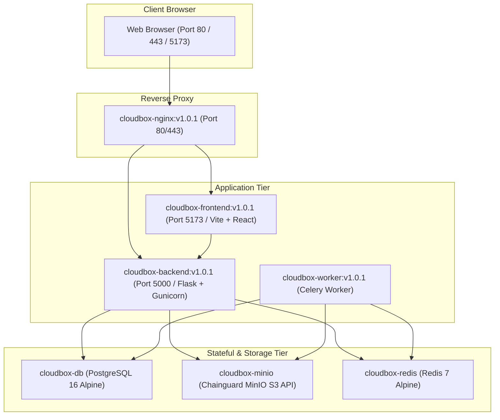

# CloudBox Shared Storage Architecture Audit

## 1. Executive Summary & Context

**Project:** CloudBox — Docker-Based Self-Hosted Cloud Storage Platform  
**Target Goal:** Transform the single-host CloudBox deployment into a multi-device shared storage architecture where two independently running CloudBox instances on two laptops (Laptop 1 and Laptop 2) connect to a shared PostgreSQL database and MinIO object storage.  
**Core Requirement:** A user logged in on either Laptop 1 or Laptop 2 must see identical files, versions, share links, storage analytics, and metadata. Uploads from Laptop 1 must be instantly accessible and downloadable on Laptop 2, and vice versa. Existing data and persistent storage volumes must be completely preserved.

---

## 2. Existing Architecture & Component Breakdown

The current CloudBox platform consists of 7 primary application containers and 5 monitoring containers running via Docker Compose on a single bridge network stack.



### Component Details
1. **Frontend (React 18 + Vite + Vanilla CSS):**
   - Base API URL configured via `VITE_API_URL` (default: `http://localhost:5000` or relative reverse-proxy path `/api`).
   - Stores JWT authentication tokens in browser `localStorage` (`cloudbox_token`).
   - Streams files directly to/from the Flask backend via multipart uploads, byte chunking, and blob downloads.
2. **Backend (Flask + Gunicorn / WSGI):**
   - REST API exposed on port 5000 (`/api/auth`, `/api/files`, `/api/uploads`, `/api/versions`, `/api/shares`, `/api/trash`, `/api/analytics`, `/api/metrics`).
   - SQLAlchemy ORM with PostgreSQL database engine.
   - MinIO Python SDK (`minio.Minio`) connecting to object storage endpoint.
   - Redis caching (`cache_service`) with user-specific keys and automatic invalidation.
   - Celery async task dispatching (`process_file_pipeline`) for image thumbnails, PDF metadata extraction, and indexing.
3. **Database (PostgreSQL 16):**
   - Tables: `users`, `files`, `file_versions`, `share_links`, `upload_sessions`, `audit_logs`.
   - Data stored in persistent Docker volume `postgres_data`.
4. **Object Storage (MinIO):**
   - Bucket: `cloudbox-uploads`.
   - Storage prefixes:
     - Root files: `{user_id}/{uuid}_{clean_filename}`
     - Chunk parts: `chunks/{session_id}/part_{chunk_number}`
     - Thumbnails: `thumbnails/{user_id}/{file_id}_thumb.jpg`
   - Data stored in persistent Docker volume `minio_data`.
5. **Cache & Message Broker (Redis 7):**
   - Used for database query caching (user file lists, metadata) and Celery task broker (`redis://:password@redis:6379/1`).
6. **Reverse Proxy (Nginx):**
   - Handles SSL termination, rate limiting (`auth_limit`, `api_general`), request routing (`/` -> frontend, `/api/` -> backend).

---

## 3. Communication & Data Flow Analysis

### A. Frontend to Backend
- In local development or containerized mode, the React app calls `${VITE_API_URL}/api/...`.
- When accessed through Nginx (port 80/443), Nginx proxies `/api/` to `backend:5000` and `/` to `frontend:5173`.
- All file binaries (upload, preview, download, thumbnails) pass through Flask endpoints. MinIO is **not directly exposed** to public client browsers for object operations; Flask backend acts as an authenticated streaming proxy.

### B. Authentication & JWT Tokens
- When a user logs in via `/api/auth/login`, the backend signs a JSON Web Token (JWT) using `JWT_SECRET_KEY` with HS256 algorithm.
- The JWT contains claims: `sub` (User UUID), `email`, `username`, `iat`, `exp`, `iss: cloudbox-auth`.
- Every authenticated request sends `Authorization: Bearer <jwt_token>`.
- **Cross-Device Implication:** If Laptop 1 and Laptop 2 share the same `JWT_SECRET_KEY`, a token issued by Laptop 1 is 100% cryptographically valid and verifiable on Laptop 2 without requiring server-side session synchronization.

### C. Database Connection & Migrations
- `Config.SQLALCHEMY_DATABASE_URI` dynamically constructs:
  `postgresql://{POSTGRES_USER}:{POSTGRES_PASSWORD}@{POSTGRES_HOST}:{POSTGRES_PORT}/{POSTGRES_DB}`
- Non-destructive idempotent schema validation runs on startup (`db.create_all()` and `ALTER TABLE ... ADD COLUMN IF NOT EXISTS`).
- Existing records (users, files, versions) remain untouched.

### D. MinIO Storage & Object Generation
- `StorageService` connects to `{MINIO_HOST}:{MINIO_API_PORT}` using `MINIO_ROOT_USER` and `MINIO_ROOT_PASSWORD`.
- Object keys use UUID-based naming (`{user_id}/{uuid}_{filename}`) to prevent path traversal and collisions.
- If both laptops point `MINIO_HOST` to the shared server, both backends will store and retrieve objects from the identical `cloudbox-uploads` bucket.

### E. Redis Caching & Celery Worker
- Redis caches file lists per user (`user:{user_id}:files:...`).
- When Laptop 1 uploads a file, it calls `cache_service.invalidate_user_cache(user_id)`.
- If both backends point to the **same shared Redis instance**, cache invalidation performed by Laptop 1 immediately clears the cache on Laptop 2.
- Celery worker running on the shared server (or shared worker pool) consumes tasks submitted by either backend.

---

## 4. Current Configuration Bottlenecks & Hardcoded Constraints

1. **Docker Compose Environment Hardcoding:**
   - In `compose.yaml` and `docker-compose.prod.yml`, `POSTGRES_HOST=db`, `MINIO_HOST=minio`, and `REDIS_HOST=redis` were hardcoded inside the container environment blocks rather than allowing variable interpolation from `.env` (`${POSTGRES_HOST:-db}`).
2. **Database and Redis Port Exposure:**
   - In `compose.yaml` and `docker-compose.prod.yml`, PostgreSQL port `5432` and Redis port `6379` are bound only to the internal Docker network `backend_net` and not exposed on host ports. For a remote laptop to connect, the shared server must expose `5432:5432` and `6379:6379` (protected by strong passwords and private network binding).
3. **MinIO Endpoint Resolution:**
   - MinIO ports `9000` (API) and `9001` (Console) are already exposed to host ports. Remote backends can connect to `http://<SHARED_HOST_IP>:9000`.

---

## 5. Proposed Shared Storage Architecture (Phase 2 Design)

### Node Topology

```
+-----------------------------------------------------------------------+
|                       SHARED SERVER (or Laptop 1 as Host)             |
|                                                                       |
|  [PostgreSQL 16]         [MinIO Storage]          [Redis 7]           |
|  Port 5432:5432          Port 9000:9000           Port 6379:6379      |
|  (postgres_data volume)  (minio_data volume)      (redis_data volume) |
|                                                                       |
|  [Celery Worker] (Optional central processor for async pipelines)     |
|  [Prometheus & Grafana] (Central observability stack)                 |
+-----------------------------------+-----------------------------------+
                                    |
                  Private LAN / VPN / Tailscale IP
                  (e.g., 192.168.1.100 or 100.x.y.z)
                                    |
          +-------------------------+-------------------------+
          |                                                   |
+---------v-------------------------+       +-----------------v-----------------+
|        LAPTOP 1 (App Node 1)      |       |        LAPTOP 2 (App Node 2)      |
|                                   |       |                                   |
| [Nginx] :80/:443                  |       | [Nginx] :80/:443                  |
| [Frontend] :5173 (React/Vite)     |       | [Frontend] :5173 (React/Vite)     |
| [Backend] :5000 (Flask)           |       | [Backend] :5000 (Flask)           |
|                                   |       |                                   |
| Env Config:                       |       | Env Config:                       |
| POSTGRES_HOST=192.168.1.100       |       | POSTGRES_HOST=192.168.1.100       |
| MINIO_HOST=192.168.1.100          |       | MINIO_HOST=192.168.1.100          |
| REDIS_HOST=192.168.1.100          |       | REDIS_HOST=192.168.1.100          |
| JWT_SECRET_KEY=<SHARED_KEY>       |       | JWT_SECRET_KEY=<SHARED_KEY>       |
| SECRET_KEY=<SHARED_KEY>           |       | SECRET_KEY=<SHARED_KEY>           |
+-----------------------------------+       +-----------------------------------+
```

---

## 6. Risk Assessment & Safety Protocols

| Risk | Impact | Mitigation Strategy |
| :--- | :--- | :--- |
| **Accidental Data Loss** | High | Never execute `docker compose down -v`. Keep existing named volumes `postgres_data` and `minio_data` intact. |
| **Schema Migration Conflicts** | Medium | Migrations use idempotent checks (`IF NOT EXISTS`). Shared database schema is strictly synchronized. |
| **Cache Incoherence** | Medium | Centralized Redis instance ensures cache invalidations from Laptop 1 immediately reflect on Laptop 2. |
| **JWT Token Mismatch** | Medium | Both laptops must share identical `JWT_SECRET_KEY` and `SECRET_KEY` values in `.env`. |
| **Unauthorized External Access** | High | PostgreSQL, Redis, and MinIO use strong passwords. Shared infrastructure binds to private LAN or VPN (Tailscale/WireGuard) rather than public 0.0.0.0. |

---

## 7. Implementation Plan

- [x] **Phase 1:** Complete architecture audit and document in `docs/SHARED_STORAGE_ARCHITECTURE_AUDIT.md`.
- [ ] **Phase 2 & 6:** Create modular Compose configurations:
  - `compose.shared.yaml` (Shared Database, MinIO, Redis, Worker)
  - `compose.app.yaml` (Application Node: Nginx, Frontend, Backend)
  - Update `compose.yaml` and `docker-compose.prod.yml` to support `${POSTGRES_HOST:-db}`, `${MINIO_HOST:-minio}`, `${REDIS_HOST:-redis}`.
  - Create `.env.shared.example` and update `.env.example`.
- [ ] **Phase 3 & 4:** Verify and validate shared PostgreSQL and MinIO connectivity.
- [ ] **Phase 5:** Ensure JWT secret alignment and cross-device session consistency.
- [ ] **Phase 7:** Document network topologies (LAN IP, Tailscale, Port Forwarding, Security).
- [ ] **Phase 8:** Comprehensive cross-device functional test suite (Test 1-5).
- [ ] **Phase 9:** Observability verification.
- [ ] **Phase 10:** Create `docs/SHARED_STORAGE_DEPLOYMENT_GUIDE.md` and update `README.md`.
- [ ] **Phase 11:** Final verification and generate `docs/SHARED_STORAGE_IMPLEMENTATION_REPORT.md`.
