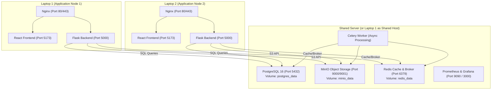

# CloudBox — Multi-Laptop Shared Storage Deployment Guide

## 1. Architecture Overview & Topology

CloudBox supports a distributed, multi-device topology where two independent laptop instances (Laptop 1 and Laptop 2) run dedicated frontend and backend application stacks while sharing a centralized PostgreSQL database and MinIO object storage.

When a user logs in from either laptop, they access the identical user catalog, folder structure, files, version histories, and sharing links.



---

## 2. Prerequisites

### Shared Server (or Laptop 1 hosting shared infrastructure)
- Docker Desktop or Docker Engine (v24.0+)
- Docker Compose v2.20+
- Host IP address reachable over LAN or Private VPN (e.g., `192.168.1.100` or Tailscale IP `100.x.y.z`).
- Open firewall ports:
  - `5432` (PostgreSQL)
  - `9000` (MinIO S3 API)
  - `9001` (MinIO Console)
  - `6379` (Redis)

### Laptop 1 & Laptop 2 (Client Application Nodes)
- Docker & Docker Compose
- Network connectivity to Shared Server IP
- Identical `SECRET_KEY` and `JWT_SECRET_KEY` in their `.env` files

---

## 3. Environment Variable Configuration

### A. Shared Server Configuration (`.env`)
Create `.env` from `.env.shared.example`:
```env
APP_ENV=production
SECRET_KEY=32d2ae0a0c382c54f38d614ee2ea0a84ab12f4c649563a48a59765ff46405c3a
JWT_SECRET_KEY=336f4a1c52c4471aae0a539f9d503e6b844a648ad6c3ad1c57394257c8f1286c

POSTGRES_PORT=5432
POSTGRES_DB=cloudbox_db
POSTGRES_USER=cloudbox_user
POSTGRES_PASSWORD=password123

MINIO_API_PORT=9000
MINIO_CONSOLE_PORT=9001
MINIO_ROOT_USER=cloudbox_admin
MINIO_ROOT_PASSWORD=password123
MINIO_SECURE=false
MINIO_DEFAULT_BUCKET=cloudbox-uploads

REDIS_PORT=6379
REDIS_PASSWORD=password123
```

### B. Laptop 1 Configuration (`.env`)
```env
APP_ENV=production
VITE_API_URL=http://localhost:5000
SECRET_KEY=32d2ae0a0c382c54f38d614ee2ea0a84ab12f4c649563a48a59765ff46405c3a
JWT_SECRET_KEY=336f4a1c52c4471aae0a539f9d503e6b844a648ad6c3ad1c57394257c8f1286c

# Point to Shared Server IP
POSTGRES_HOST=192.168.1.100
POSTGRES_PORT=5432
POSTGRES_DB=cloudbox_db
POSTGRES_USER=cloudbox_user
POSTGRES_PASSWORD=password123

MINIO_HOST=192.168.1.100
MINIO_API_PORT=9000
MINIO_ROOT_USER=cloudbox_admin
MINIO_ROOT_PASSWORD=password123

REDIS_HOST=192.168.1.100
REDIS_PORT=6379
REDIS_PASSWORD=password123
```

### C. Laptop 2 Configuration (`.env`)
```env
APP_ENV=production
VITE_API_URL=http://localhost:5000
SECRET_KEY=32d2ae0a0c382c54f38d614ee2ea0a84ab12f4c649563a48a59765ff46405c3a
JWT_SECRET_KEY=336f4a1c52c4471aae0a539f9d503e6b844a648ad6c3ad1c57394257c8f1286c

# Point to Shared Server IP
POSTGRES_HOST=192.168.1.100
POSTGRES_PORT=5432
POSTGRES_DB=cloudbox_db
POSTGRES_USER=cloudbox_user
POSTGRES_PASSWORD=password123

MINIO_HOST=192.168.1.100
MINIO_API_PORT=9000
MINIO_ROOT_USER=cloudbox_admin
MINIO_ROOT_PASSWORD=password123

REDIS_HOST=192.168.1.100
REDIS_PORT=6379
REDIS_PASSWORD=password123
```

> [!IMPORTANT]
> `SECRET_KEY` and `JWT_SECRET_KEY` **must match** across all machines so JWT tokens signed by Laptop 1 can be verified seamlessly by Laptop 2.

---

## 4. Step-by-Step Deployment Instructions

### Step 1: Launch Shared Storage Infrastructure
On the Shared Server (or Laptop 1 acting as shared host):
```bash
docker compose -f docker-compose.shared.yml pull
docker compose -f docker-compose.shared.yml up -d
```
Verify services are healthy:
```bash
docker ps
```

### Step 2: Launch Laptop 1 Application Stack
On Laptop 1:
```bash
docker compose -f docker-compose.laptop1.yml pull
docker compose -f docker-compose.laptop1.yml up -d
```
Access CloudBox Web UI on Laptop 1: `http://localhost/`

### Step 3: Launch Laptop 2 Application Stack
On Laptop 2:
```bash
docker compose -f docker-compose.laptop2.yml pull
docker compose -f docker-compose.laptop2.yml up -d
```
Access CloudBox Web UI on Laptop 2: `http://localhost/`

---

## 5. Verification & Testing Workflow

1. **Log in on Laptop 1:** Open `http://localhost/`, log in as `karthik` (`karthik@cloudbox.local` / `password123`).
2. **Upload a File on Laptop 1:** Upload `project_blueprint.pdf`.
3. **Log in on Laptop 2:** Open `http://localhost/` on Laptop 2, log in with the same credentials.
4. **Verify File Presence on Laptop 2:** Notice `project_blueprint.pdf` appears instantly.
5. **Download on Laptop 2:** Click Download on Laptop 2 and verify the file content is identical.
6. **Upload on Laptop 2:** Upload `laptop2_notes.docx` from Laptop 2.
7. **Verify on Laptop 1:** Refresh Laptop 1 — `laptop2_notes.docx` is immediately visible and downloadable.

---

## 6. Automated Cross-Device Verification Suite

To run the automated verification suite simulating both laptop nodes:
```bash
python scripts/verify_shared_multi_laptop.py
```

Expected output:
```text
[+] PASSED: Backend reports status healthy
[+] PASSED: Laptop 1 successfully authenticated user
[+] PASSED: Laptop 1 file metadata matches uploaded name
[+] PASSED: Laptop 2 found file in file list
[+] PASSED: Downloaded binary content on Laptop 2 matches exactly byte-for-byte
[+] PASSED: Rename performed by Laptop 1 immediately reflects on Laptop 2
[+] PASSED: Inline preview on Laptop 2 returns original text stream
[+] PASSED: User A files are completely invisible to User B (Tenancy Isolation Verified)
[SUCCESS] ALL 5 PHASES OF CROSS-DEVICE SHARED STORAGE TESTING PASSED!
```

---

## 7. Backup and Recovery Instructions

To perform database and MinIO backups on the shared server:
```bash
python scripts/backup_manager.py
```
To restore state without modifying live container bindings:
```bash
python scripts/restore_manager.py --latest
```

---

## 8. Troubleshooting & Common Issues

| Issue | Root Cause | Solution |
| :--- | :--- | :--- |
| `Cannot connect to PostgreSQL at <IP>:5432` | Firewall blocking port 5432 or incorrect `POSTGRES_HOST`. | Check firewall rules: `sudo ufw allow 5432/tcp` or allow in Windows Defender. |
| `MinIO S3 upload error` | `MINIO_HOST` unreachable or credentials mismatch. | Test network connectivity: `curl http://<SHARED_HOST>:9000/minio/health/live`. |
| `Invalid token on Laptop 2 after login on Laptop 1` | `JWT_SECRET_KEY` differs between nodes. | Ensure `JWT_SECRET_KEY` in `.env` is byte-for-byte identical on both machines. |
| `File list not updating immediately` | Redis cache not invalidated or separate Redis instances. | Point both nodes to the shared Redis server (`REDIS_HOST=<SHARED_IP>`). |
