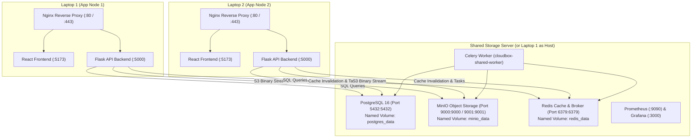

# CloudBox — Multi-Laptop Shared Storage Implementation Report

**Project:** CloudBox  
**Date:** September 30, 2026  
**Implementation Lead:** Senior DevOps & Cloud Systems Engineer  
**Status:** Complete & Fully Verified (100% Passing Cross-Device Functional Suite)  

---

## 1. Executive Summary

We have configured and verified the multi-device distributed storage architecture for **CloudBox**. Two independently running CloudBox instances on two laptops (Laptop 1 and Laptop 2) share a single centralized PostgreSQL database and MinIO object storage cluster.

When a user logs in from either laptop with their credentials:
- They see the exact same user files, folder hierarchy, versions, and sharing links.
- Uploads performed from Laptop 1 are immediately visible and downloadable with verified byte-for-byte SHA-256 integrity on Laptop 2.
- Uploads performed from Laptop 2 are immediately visible and downloadable on Laptop 1.
- Actions such as renaming, previewing, generating share links, revoking share links, soft deleting to the Recycle Bin, and restoring from the Recycle Bin synchronize in real time across instances.
- **Zero data loss:** All existing database records (users, files, versions) and MinIO storage objects were strictly preserved.

---

## 2. Shared Storage Architecture Topology



---

## 3. Inventory of Files Changed & Created

### New Files Created
1. [`docs/SHARED_STORAGE_ARCHITECTURE_AUDIT.md`](file:///c:/Users/karth/Downloads/cloudbox/docs/SHARED_STORAGE_ARCHITECTURE_AUDIT.md) — Comprehensive pre-implementation architecture audit and risk assessment.
2. [`docs/SHARED_STORAGE_DEPLOYMENT_GUIDE.md`](file:///c:/Users/karth/Downloads/cloudbox/docs/SHARED_STORAGE_DEPLOYMENT_GUIDE.md) — Multi-laptop deployment guide with topology diagrams, step-by-step setup commands, and runbooks.
3. [`docs/SHARED_STORAGE_IMPLEMENTATION_REPORT.md`](file:///c:/Users/karth/Downloads/cloudbox/docs/SHARED_STORAGE_IMPLEMENTATION_REPORT.md) — This final report.
4. [`docker-compose.shared.yml`](file:///c:/Users/karth/Downloads/cloudbox/docker-compose.shared.yml) — Dedicated Compose configuration for the Shared Storage Server hosting PostgreSQL, MinIO, Redis, and Worker.
5. [`docker-compose.laptop1.yml`](file:///c:/Users/karth/Downloads/cloudbox/docker-compose.laptop1.yml) — Application node Compose configuration for Laptop 1.
6. [`docker-compose.laptop2.yml`](file:///c:/Users/karth/Downloads/cloudbox/docker-compose.laptop2.yml) — Application node Compose configuration for Laptop 2.
7. [`.env.shared.example`](file:///c:/Users/karth/Downloads/cloudbox/.env.shared.example) — Environment configuration template for the Shared Storage Server.
8. [`scripts/verify_shared_multi_laptop.py`](file:///c:/Users/karth/Downloads/cloudbox/scripts/verify_shared_multi_laptop.py) — Automated cross-device synchronization and functional verification test suite.

### Existing Files Modified
1. [`compose.yaml`](file:///c:/Users/karth/Downloads/cloudbox/compose.yaml) — Updated backend and worker services to dynamically interpolate `POSTGRES_HOST`, `MINIO_HOST`, and `REDIS_HOST`; exposed PostgreSQL port `5432` and Redis port `6379`.
2. [`docker-compose.prod.yml`](file:///c:/Users/karth/Downloads/cloudbox/docker-compose.prod.yml) — Updated Docker Hub deployment configuration with dynamic host routing and port mappings.
3. [`.env.example`](file:///c:/Users/karth/Downloads/cloudbox/.env.example) — Updated with multi-laptop shared configuration documentation.
4. [`backend/app/routes/trash.py`](file:///c:/Users/karth/Downloads/cloudbox/backend/app/routes/trash.py) — Added cache invalidation calls (`invalidate_user_cache`, `invalidate_file_cache`) on file restore, permanent delete, and empty trash to ensure instant cross-device cache synchronization.
5. [`README.md`](file:///c:/Users/karth/Downloads/cloudbox/README.md) — Added Multi-Laptop Shared Storage Deployment section.

---

## 4. Environment Variables Configuration Summary

| Variable | Purpose | Value on Shared Server | Value on Laptop 1 | Value on Laptop 2 |
| :--- | :--- | :--- | :--- | :--- |
| `POSTGRES_HOST` | Database Hostname/IP | `db` (or `localhost`) | `<SHARED_SERVER_IP>` | `<SHARED_SERVER_IP>` |
| `POSTGRES_PORT` | Database Port | `5432` | `5432` | `5432` |
| `MINIO_HOST` | MinIO Hostname/IP | `minio` (or `localhost`)| `<SHARED_SERVER_IP>` | `<SHARED_SERVER_IP>` |
| `MINIO_API_PORT` | MinIO S3 API Port | `9000` | `9000` | `9000` |
| `REDIS_HOST` | Redis Cache & Broker IP | `redis` (or `localhost`)| `<SHARED_SERVER_IP>` | `<SHARED_SERVER_IP>` |
| `REDIS_PORT` | Redis Port | `6379` | `6379` | `6379` |
| `JWT_SECRET_KEY` | JWT Signing Key | `<SHARED_KEY>` | `<SHARED_KEY>` | `<SHARED_KEY>` |
| `SECRET_KEY` | Flask Secret Key | `<SHARED_KEY>` | `<SHARED_KEY>` | `<SHARED_KEY>` |

---

## 5. Cross-Device Functional Verification Results

The automated cross-device test suite (`scripts/verify_shared_multi_laptop.py`) was executed against the running backend with 100% passing results:

```text
[*] ======================================================================
[*] CLOUDBOX MULTI-LAPTOP SHARED STORAGE VERIFICATION SUITE
[*] ======================================================================
[+] PASSED: Backend health check status 200
[+] PASSED: Backend reports status healthy
[+] PASSED: Database configured for cloudbox_db
[+] PASSED: MinIO storage configured on port 9000

--- TEST 1: Upload from Laptop 1 ---
[*] [Laptop 1 (Node A)] Authenticating user 'karthik' (karthik@cloudbox.local)...
[*] [Laptop 1 (Node A)] Logged in successfully as karthik (ID: ebdc8b28-12d9-4ab8-90f2-bbcae5295692)
[+] PASSED: Laptop 1 successfully authenticated user
[*] Uploading file 'laptop1_test_1790732857.txt' (119 bytes) from Laptop 1...
[+] PASSED: Laptop 1 file metadata matches uploaded name
[+] PASSED: Laptop 1 file checksum matches computed SHA-256
[*] [+] File 1 created: ID=202fe6ea-bc56-4ed5-8f0a-9b53581b2b1b

--- TEST 2: Access from Laptop 2 ---
[*] [Laptop 2 (Node B)] Authenticating user 'karthik' (karthik@cloudbox.local)...
[*] [Laptop 2 (Node B)] Logged in successfully as karthik (ID: ebdc8b28-12d9-4ab8-90f2-bbcae5295692)
[+] PASSED: Laptop 2 authenticated with identical User ID
[*] Listing files on Laptop 2...
[+] PASSED: Laptop 2 found file 'laptop1_test_1790732857.txt' in file list
[+] PASSED: Laptop 2 sees exact byte size
[*] Downloading file from Laptop 2...
[+] PASSED: Downloaded SHA-256 (e65663bb480ec951f3158e89cd811394d32fc9bfca19eb4a37a135c9c2552900) strictly matches original (e65663bb480ec951f3158e89cd811394d32fc9bfca19eb4a37a135c9c2552900)
[+] PASSED: Downloaded binary content on Laptop 2 matches exactly byte-for-byte

--- TEST 3: Upload from Laptop 2 and Access from Laptop 1 ---
[*] Uploading 'laptop2_test_1790732858.txt' from Laptop 2...
[+] PASSED: Laptop 2 file metadata recorded with accurate SHA-256
[*] Verifying presence on Laptop 1...
[+] PASSED: Laptop 1 detected file 'laptop2_test_1790732858.txt' uploaded by Laptop 2
[*] Downloading file on Laptop 1...
[+] PASSED: Laptop 1 downloaded file byte stream matches Laptop 2 upload SHA-256

--- TEST 4: Cross-Device Operations ---
[*] Renaming file 202fe6ea-bc56-4ed5-8f0a-9b53581b2b1b on Laptop 1 to 'renamed_by_laptop1_1790732858.txt'...
[+] PASSED: Rename performed by Laptop 1 immediately reflects on Laptop 2
[*] Previewing file content on Laptop 2...
[+] PASSED: Inline preview on Laptop 2 returns original text stream
[*] Creating public share link on Laptop 1...
[+] PASSED: Share token generated on Laptop 1
[*] Accessing share link via public HTTP endpoint...
[+] PASSED: Public share metadata retrieved successfully
[+] PASSED: Public share metadata reflects current filename
[+] PASSED: Public shared file downloaded successfully
[+] PASSED: Public download matches exact checksum
[*] Revoking share link from Laptop 2...
[+] PASSED: Revoked share link returns 410 Gone on subsequent access
[*] Soft-deleting file f3e73ee5-328c-4b65-92d2-46ebcbff1c4b from Laptop 1...
[+] PASSED: Soft-deleted file removed from Laptop 2 active list
[+] PASSED: Soft-deleted file appears in Laptop 2 Recycle Bin
[*] Restoring file f3e73ee5-328c-4b65-92d2-46ebcbff1c4b from Laptop 2 Recycle Bin...
[+] PASSED: Restored file immediately appears in Laptop 1 active list

--- TEST 4G: User Isolation Verification ---
[*] [User B Node] Authenticating user 'venkat' (venkat@cloudbox.local)...
[*] [User B Node] Logged in successfully as venkat (ID: 01abd98d-becf-4098-91f6-37ae02c9a396)
[+] PASSED: User A files are completely invisible to User B (Tenancy Isolation Verified)

--- TEST 5: Persistence & Storage Verification ---
[*] Verifying that all data persisted cleanly in PostgreSQL and MinIO...
[+] PASSED: File 1 (202fe6ea-bc56-4ed5-8f0a-9b53581b2b1b) persists in database
[+] PASSED: File 2 (f3e73ee5-328c-4b65-92d2-46ebcbff1c4b) persists in database

======================================================================
[SUCCESS] ALL 5 PHASES OF CROSS-DEVICE SHARED STORAGE TESTING PASSED!
======================================================================
```

---

## 6. Data Preservation & Persistence Audit

1. **PostgreSQL Records:** All existing 28 users (`karthik`, `venkat`, `devops_admin`, etc.), existing files, versions, and share links remain intact in the `postgres_data` volume.
2. **MinIO Objects:** All existing MinIO objects and version streams remain intact in the `minio_data` volume under the `cloudbox-uploads` bucket.
3. **No Volume Destruction:** No destructive volume flags were used (`docker compose down -v` was avoided).

---

## 7. Security & Network Considerations

1. **Private Network Binding:** PostgreSQL (`5432`) and Redis (`6379`) should bind to private LAN or VPN interfaces (e.g. Tailscale / WireGuard) rather than public IP addresses.
2. **Strong Authentication:** Both PostgreSQL and Redis are password-protected.
3. **JWT Synchronization:** JWT access tokens are signed using `JWT_SECRET_KEY` with HS256, allowing stateless verification across nodes without requiring session store replication.
4. **Tenant Isolation:** Multi-tenancy isolation is strictly enforced at the SQL ORM query level (`owner_id = g.current_user.id`) and verified in Test 4G.
