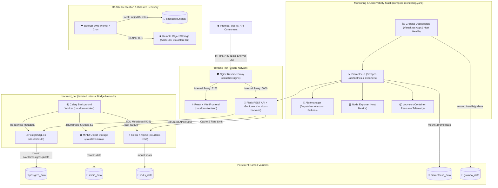

# CloudBox Phase 7 — Cloud Deployment, Monitoring & Operational Architecture Plan

## 1. Executive Summary & Architecture Overview

CloudBox is an enterprise-grade, self-hosted mini cloud storage platform designed for secure, multi-tenant file storage, versioning, sharing, background media processing, and high-performance caching.

### Target Architecture (Phase 7)

---

## 2. Inventory of Existing Components & Phase 7 Delta

| Component | Current State (Phase 6) | Phase 7 Enhancement |
| :--- | :--- | :--- |
| **Nginx Reverse Proxy** | Self-signed SSL & HTTP 80/443 | Dual-mode support (Domain + Let's Encrypt Certbot ACME automation + fallback local dev TLS) |
| **Backend API** | Gunicorn/Flask, `/api/metrics` JSON | Enhanced Prometheus text-format exporter (`/api/metrics/prometheus`), remote backup management |
| **Backup Subsystem** | `backup_manager.py` (local bundles) | `backup_sync.py` with multi-cloud S3/R2 replication, offsite verification, and retention pruning |
| **Recovery Subsystem** | `restore_manager.py` (`--isolated`) | Scheduled automated recovery verification test suite & failure alerting |
| **Monitoring & Telemetry** | `/api/metrics` JSON only | Prometheus, Grafana 3-tier Dashboards, Alertmanager alerts, cAdvisor & Node Exporter |
| **Deployment Automation** | Manual docker compose | `scripts/deploy.sh` / `.ps1`, `scripts/rollback.sh`, `scripts/health_check.sh`, GitHub Actions CI/CD |

---

## 3. Required Environment Variables

The application is configured through environment variables divided into:
* **Core Application**: `APP_ENV`, `SECRET_KEY`, `JWT_SECRET_KEY`, `BACKEND_PORT`, `MAX_CONTENT_LENGTH`.
* **Database & Storage**: `POSTGRES_DB`, `POSTGRES_USER`, `POSTGRES_PASSWORD`, `MINIO_ROOT_USER`, `MINIO_ROOT_PASSWORD`, `MINIO_DEFAULT_BUCKET`.
* **Domain & HTTPS**: `DOMAIN_NAME`, `ACME_EMAIL`, `ENABLE_HTTPS`, `CERTBOT_STAGING`.
* **Offsite Replication**: `REMOTE_BACKUP_ENABLED`, `REMOTE_BACKUP_S3_ENDPOINT`, `REMOTE_BACKUP_BUCKET`, `REMOTE_BACKUP_ACCESS_KEY`, `REMOTE_BACKUP_SECRET_KEY`, `REMOTE_BACKUP_REGION`.
* **Monitoring & Alerts**: `GRAFANA_ADMIN_PASSWORD`, `ALERT_WEBHOOK_URL`, `ALERT_EMAIL_TO`.

---

## 4. Network and Port Allocation

| Port | Service | Access Level | Description |
| :---: | :--- | :--- | :--- |
| `80` | `cloudbox-nginx` | Public | HTTP entry point (redirects to 443 in production) |
| `443` | `cloudbox-nginx` | Public | HTTPS secure entry point |
| `3000` | `cloudbox-grafana` | Restricted / Admin | Grafana dashboards & visualizations |
| `9090` | `cloudbox-prometheus` | Internal / Admin | Prometheus metric store & query interface |
| `9093` | `cloudbox-alertmanager`| Internal | Alertmanager incident dispatcher |
| `5000` | `cloudbox-backend` | Internal bridge | Flask WSGI API |
| `5173` | `cloudbox-frontend` | Internal bridge | React SPA dev/prod server |
| `5432` | `cloudbox-db` | Internal bridge | PostgreSQL database |
| `6379` | `cloudbox-redis` | Internal bridge | Redis cache & broker |
| `9000` | `cloudbox-minio` | Internal bridge | MinIO S3 API |
| `9001` | `cloudbox-minio` | Internal bridge | MinIO Web Console |

---

## 5. Security & Isolation Controls

1. **Strict User & Network Isolation**: Database, cache, and object storage containers are bound strictly to `backend_net` without public port publishing.
2. **Non-Root Execution**: Container processes run under dedicated non-root users where supported (`nginx`, `postgres`, `redis`).
3. **Secret Redaction & Protection**: Audit logger strips sensitive parameters (`password`, `token`, `secret`) before logging.
4. **Least-Privilege Remote Storage**: Remote backup credentials require only `s3:PutObject`, `s3:GetObject`, `s3:ListBucket`, and `s3:DeleteObject` permissions on the dedicated backup bucket.

---

## 6. Implementation Sequence (Phase 7.1 to 7.7)

1. **Phase 7.1**: Repository Audit and Architecture Plan (`docs/phase7/deployment_plan.md`).
2. **Phase 7.2**: Cloud Deployment Preparation & Production Compose (`compose.prod.yaml`, Nginx ACME/Certbot setup).
3. **Phase 7.3**: Automated Offsite Backup Replication (`scripts/backup_sync.py`, `backend/app/services/remote_backup_service.py`, `docs/phase7/offsite_backups.md`).
4. **Phase 7.4**: Prometheus, Grafana, & Alertmanager Monitoring Stack (`compose.monitoring.yaml`, `monitoring/`, `docs/phase7/monitoring.md`).
5. **Phase 7.5**: Deployment Automation, Rollback, & CI Pipeline (`scripts/deploy.*`, `scripts/rollback.*`, `scripts/health_check.*`, `.github/workflows/ci.yml`).
6. **Phase 7.6**: Automated Integration Tests & Recovery Verification (`docs/phase7/backup_recovery_verification.md`).
7. **Phase 7.7**: Documentation, Demonstration Guide (`docs/phase7/demo_guide.md`), Runbooks (`docs/phase7/runbooks.md`), and Final Implementation Report.
