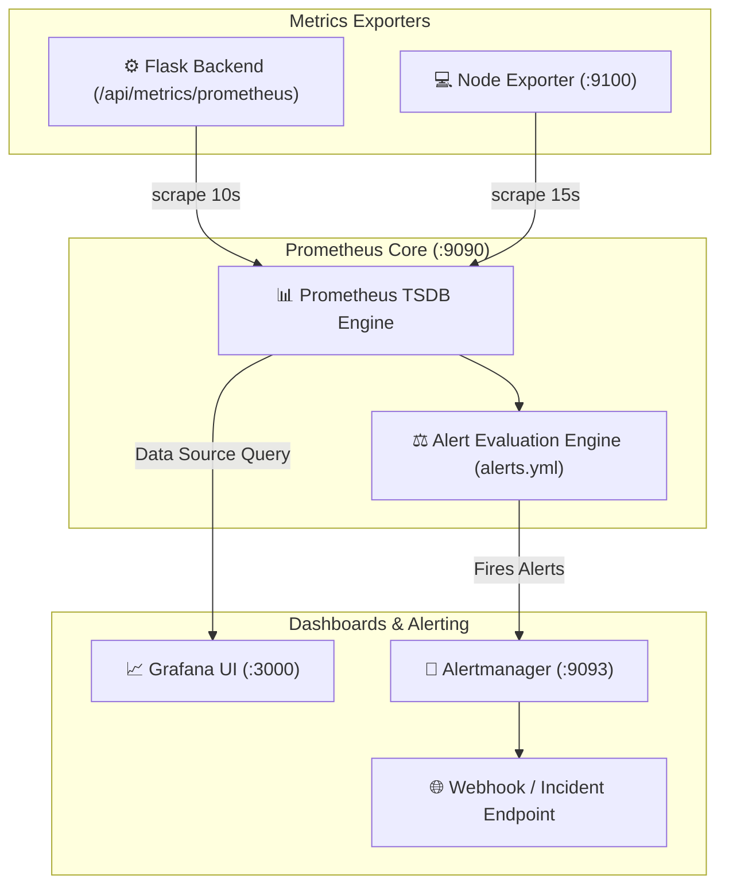

# CloudBox — Prometheus & Grafana Monitoring Architecture

This document describes the observability, metrics exposition, alerting, and dashboard architecture for CloudBox.

---

## 1. Monitoring Stack Architecture



---

## 2. Exposed Metrics Reference

| Metric Name | Type | Description |
| :--- | :--- | :--- |
| `cloudbox_uptime_seconds` | Gauge | Backend process uptime in seconds |
| `cloudbox_db_up` | Gauge | Database connectivity status (`1`=up, `0`=down) |
| `cloudbox_redis_up` | Gauge | Redis cache connectivity status (`1`=up, `0`=down) |
| `cloudbox_users_total` | Gauge | Registered user count in PostgreSQL |
| `cloudbox_files_total` | Gauge | Total uploaded files across system |
| `cloudbox_files_active` | Gauge | Active files excluding Recycle Bin |
| `cloudbox_active_upload_sessions` | Gauge | In-flight multipart chunked upload sessions |
| `cloudbox_cache_hits_total` | Counter | Total Redis cache hit counter |
| `cloudbox_cache_misses_total` | Counter | Total Redis cache miss counter |
| `cloudbox_cache_hit_ratio` | Gauge | Redis hit ratio (`0.0` to `1.0`) |
| `cloudbox_backup_latest_status` | Gauge | Last backup pipeline status (`1`=success, `0`=failed) |
| `cloudbox_backup_latest_size_bytes` | Gauge | Byte size of the most recent backup bundle |
| `cloudbox_backup_recovery_verification_status` | Gauge | Last isolated recovery test status (`1`=passed, `0`=failed) |

---

## 3. Pre-Provisioned Grafana Dashboards

Grafana automatically loads pre-configured dashboards located in `monitoring/grafana/dashboards/`:

1. **Application Overview (`cloudbox-app-overview`)**:
   - Backend uptime, registered users, active files, and cache hit ratio gauges.
   - Cache throughput (hits vs misses per second).
   - In-flight upload session throughput.

2. **Infrastructure Health (`cloudbox-infra-health`)**:
   - Live connectivity status for PostgreSQL, Redis, and Backend scraper.
   - Container RAM and CPU utilization trends.

3. **Backup & Disaster Recovery (`cloudbox-backup-recovery`)**:
   - Latest backup execution result (`SUCCESS [✓]` / `FAILED`).
   - Latest isolated DR test verification result (`VERIFIED [✓]` / `FAILED`).
   - Backup bundle size growth history over time.

---

## 4. Starting the Monitoring Stack

```bash
# Start core application + monitoring stack
docker compose -f compose.yaml -f compose.monitoring.yaml up -d

# Verify monitoring services are running
docker compose -f compose.yaml -f compose.monitoring.yaml ps
```

* **Grafana UI**: `http://localhost:3000` (User: `admin`, Password: `${GRAFANA_ADMIN_PASSWORD}`).
* **Prometheus UI**: `http://localhost:9090`.
* **Alertmanager UI**: `http://localhost:9093`.
